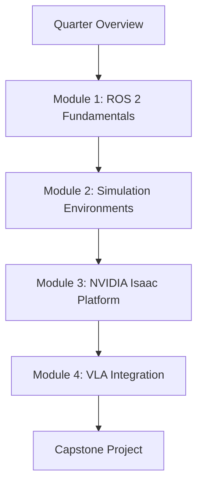

# 🤖 Physical AI & Humanoid Robotics

Welcome to the most exciting frontier in artificial intelligence! This course bridges the gap between digital intelligence and physical embodiment.

## 🎯 Course Focus & Theme
**AI Systems in the Physical World | Embodied Intelligence**

Our goal is simple yet profound: **Bridging the gap between the digital brain and the physical body**. You'll learn to apply AI knowledge to control Humanoid Robots in both simulated and real-world environments.

## 🚀 Why This Matters Now?

  

    <h3>The Physical AI Revolution</h3>
  

  

    
Humanoid robots are poised to excel in our human-centered world because they share our physical form and can be trained with abundant data from interacting in human environments.

    
This represents a <strong>significant transition</strong> from AI models confined to digital environments to <strong>embodied intelligence</strong> that operates in physical space.

  

## 📚 What You'll Master

  

    

      

        <h4>🤖 ROS 2 Mastery</h4>
      

      

        
Robot Operating System - The nervous system of modern robotics

      

    

  

  

    

      

        <h4>🌍 Simulation Expertise</h4>
      

      

        
Gazebo & Unity for creating digital twins of real-world environments

      

    

  

  

    

      

        <h4>🧠 AI Integration</h4>
      

      

        
NVIDIA Isaac platform and VLA models for intelligent robotics

      

    

  

## 🎓 Learning Outcomes

By completing this course, you will:

- ✅ **Understand** Physical AI principles and embodied intelligence
- ✅ **Master** ROS 2 (Robot Operating System) for robotic control  
- ✅ **Simulate** robots with Gazebo and Unity
- ✅ **Develop** with NVIDIA Isaac AI robot platform
- ✅ **Design** humanoid robots for natural interactions
- ✅ **Integrate** GPT models for conversational robotics

## 🗓️ Course Structure

# 🎯 Who Is This Course For?

- **AI Engineers** wanting to move from digital to physical AI  
- **Robotics Students** seeking industry-relevant skills  
- **Researchers** exploring embodied intelligence  
- **Developers** interested in the future of human-robot interaction  

:::tip Ready to Begin?
This course is designed to take you from **zero to hero in Physical AI**.  
Each module builds upon the previous one, creating a comprehensive learning journey.
:::

