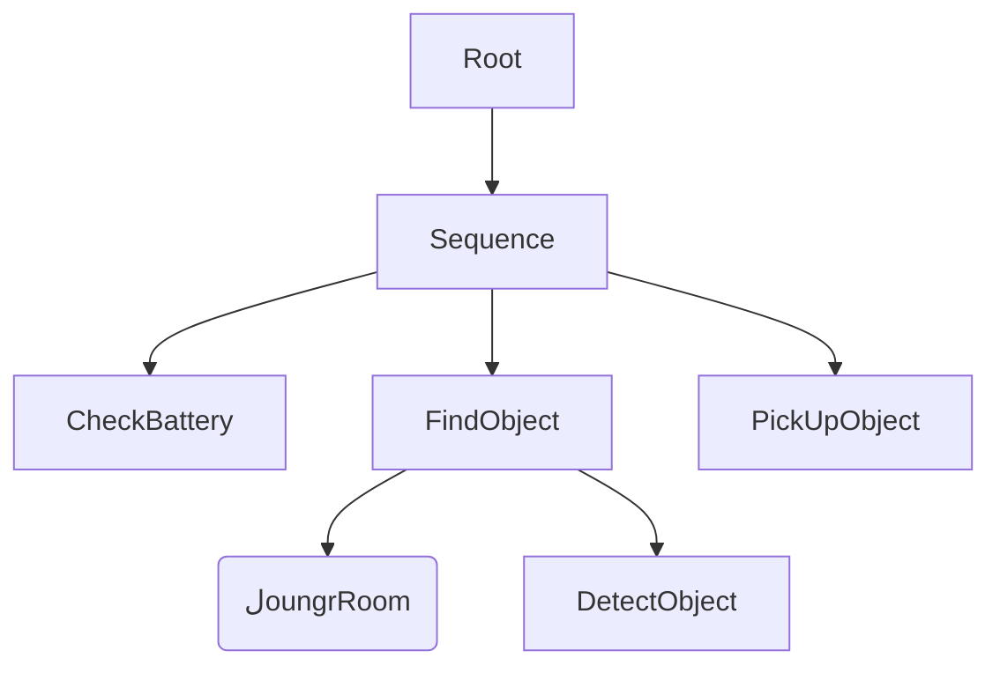

# کیپسٹون پروجیکٹ: فزیکل AI کے تصورات کو یکجا کرنا

## 1. تعارف اور سیکھنے کے اہداف

یہ کیپسٹون پروجیکٹ آپ کے فزیکل AI میں داخلے کا اختتام ہے۔ یہ صرف ایک کوڈنگ مشق نہیں ہے؛ یہ ایک سسٹم انضمام کا چیلنج ہے۔ آپ ایک منظم روبوٹ سسٹم تیار کریں گے جو **ادراک (کمپیوٹر وژن)**، **ادراک (راستہ منصوبہ بندی اور منطق)**، اور **ایکشن (کنٹرول اور مینوپولیشن)** کو جوڑتا ہے۔

**اس پروجیکٹ کے اختتام تک، آپ کے اہل ہوں گے:**
* **آرکیٹیکٹ:** ایک مکمل اسٹیک ROS 2 روبوٹک سسٹم کو ڈیزائن کرنا جو سیمولیشن (Isaac Sim) کو منطق سے جوڑتا ہے۔
* **انضمام:** AI ادراک ماڈلز (YOLO/SSD) کو نیویگیشن اسٹیکس (Nav2) سے منسلک کرنا۔
* **سیمولیٹ کرنا:** "Sim-to-Real" منظار کو ٹیسٹ کرنے کے لیے ایک اعلی معیار کا ڈیجیٹل ٹوئن ماحول تخلیق کرنا۔
* **مربوط کرنا:** پیچیدہ متعدد اسٹیج کے کاموں کو خود بخود منظم کرنے کے لیے بیہیویئر ٹریز کا استعمال کرنا۔
* **تجزیہ کرنا:** سسٹم کی دیری، استدلال کی رفتار، اور نیویگیشن کی درستگی کا جائزہ لینا۔

---

## 2. پروجیکٹ کا منظر: "سمارٹ ہوم اسسٹنٹ"

**چیلنج:**
ایک ہیومنوائڈ (یا موبل مینوپولیٹر) روبوٹ کو ڈیزائن، پروگرام، اور ایک سیمولیٹڈ اپارٹمنٹ میں ایک خود کار فیچ اینڈ کیری کام کو انجام دینے کے لیے سیمولیٹ کریں۔

**میشن:**
1.  **اٹھنا:** روبوٹ "چارجنگ ڈاک" (کچن) میں شروع ہوتا ہے۔
2.  **سننا:** ایک کمانڈ وصول کریں (مثلاً، "مجھے لونگ روم سے لال کین لانے کے لیے")۔
3.  **رہنمائی:** کچن سے لونگ روم تک جانا جبکہ متحرک رکاوٹوں (کرسیاں/میزیں) سے بچتے ہوئے۔
4.  **ادراک:** کمرے کو اسکین کریں، گہرائی سیکھنے کے ماڈل کا استعمال کرتے ہوئے مخصوص چیز کو تلاش کریں۔
5.  **مینوپولیٹ کرنا:** چیز کے قریب جائیں، ایک گریسنگ ٹریجیکٹری منصوبہ بندی کریں، اور اسے اٹھائیں۔
6.  **پہنچانا:** صارف کے مقام پر واپس جائیں اور چیز کو محفوظ طریقے سے چھوڑ دیں۔

---

## 3. سسٹم کی تعمیر

ایک مضبوط فزیکل AI سسٹم کو ایک تہوار تعمیر کی ضرورت ہوتی ہے۔ ہم **ROS 2 Humble** کو مڈل ویئر کے طور پر اور **NVIDIA Isaac Sim** کو جسمانی سیمولیشن کے لیے استعمال کریں گے۔

### 3.1 اعلیٰ سطحی بلاک ڈائیگرام

| تہوار | جزو | ٹیکنالوجی/اوزار |
| :--- | :--- | :--- |
| **سیمولیشن** | فزکس اور رینڈرنگ | NVIDIA Isaac Sim (USD ماحول) |
| **ہارڈ ویئر کا ابستریکشن** | سینسرز اور ایکچوایشن | `ros2_control`, Isaac ROS برج |
| **ادراک** | آبجیکٹ ڈیٹیکشن | `isaac_ros_dnn_inference` (YOLOv8) یا `tensorflow` |
| **مقام کاری** | SLAM/نقشہ | `isaac_ros_vslam` یا `slam_toolbox` |
| **نیویگیشن** | راستہ منصوبہ بندی | `Nav2` (بیہیویئر ٹری کی بنیاد پر نیویگیشن) |
| **مینوپولیشن** | بازو ٹریجیکٹری | `MoveIt 2` |
| **ایگزیکیوٹو** | کام کا منطق | `BehaviorTree.CPP` یا `py_trees` |

### 3.2 تفصیل ڈیٹا فلو

1.  **ان پٹ:** Isaac Sim سے RGB-D کیمرہ سٹریم $\rightarrow$ ROS 2 ٹاپک `/camera/rgb/image_raw`۔
2.  **AI استدلال:** نیورل نیٹ ورک تصویر کو سبسکرائب کرتا ہے $\rightarrow$ `/detections/output` (باؤنڈنگ باکسز) کو شائع کرتا ہے۔
3.  **TF ٹری:** ٹرانسفارمیشن سسٹم باؤنڈنگ باکس (2D) کو ورلڈ کوآرڈینیٹس (3D) میں تبدیل کرتا ہے۔
4.  **فیصلہ:** ٹاسک منیجر `/navigate_to_pose` کو گول پوز بھیجتا ہے۔
5.  **ایکشن:** Nav2 رفتار کا حساب لگاتا ہے $\rightarrow$ روبوٹ بیس کو `/cmd_vel` بھیجتا ہے۔

---

## 4. نفاذ ہدایات

### فیز 1: ماحول اور روبوٹ سیٹ اپ
اس کے بجائے کہ از نو تعمیر کریں، USD (یونیورسل سین ڈیسکرپشن) کی طاقت کا استعمال کریں۔
* **سیمولیٹر:** NVIDIA Isaac Sim.
* **روبوٹ:** ایک معیاری حوالہ کا استعمال کریں جیسے **Franka Emika Panda** (موبل بیس) یا چوکورپیڈ کاموں کے لیے **Unitree Go1**۔
* **ROS 2 برج:** یقینی بنائیں کہ Isaac Sim میں `ros2_bridge` ایکسٹینشن فعال ہے تاکہ Omniverse فزکس کو ROS ٹاپکس میں میپ کیا جا سکے۔

### فیز 2: ادراک (فزیکل AI میں "AI")
آپ کو ایک نوڈ نافذ کرنا ہوگا جو "دیکھ" سکے۔
* **ماڈل:** TensorRT کے لیے بہترین YOLOv8 ماڈل کا استعمال کریں۔
* **ROS نوڈ:** ایک پیکج `my_robot_perception` تخلیق کریں۔
* **اہم کام:** کیمرہ فیڈ کو سبسکرائب کریں اور ایک کسٹم میسج `ObjectInfo` شائع کریں جس میں چیز کا لیبل اور 3D کوآرڈینیٹس ($x, y, z$) روبوٹ بیس کے رشتے میں شامل ہوں۔

### فیز 3: نیویگیشن (Nav2 انضمام)
A* الگوردمز کو از نو لکھنے کے بجائے، **Nav2 اسٹیک** کو تشکیل دیں۔
* **میپنگ:** سیمولیٹڈ ہوم کو میپ کرنے کے لیے "لائف لانگ" موڈ میں `slam_toolbox` کا استعمال کریں۔
* **کوسٹ میپس:** `local_costmap` (فوراً رکاوٹوں جیسے چلنے والے انسان سے بچنے کے لیے) اور `global_costmap` (کمرہ سے کمرہ کی منصوبہ بندی کے لیے) کو تشکیل دیں۔

### فیز 4: کام کا منظم کار (بیہیویئر ٹریز)
پیشہ ورانہ روبوٹکس بیہیویئر ٹریز (BT)، سادہ `if-else` لوپس کا استعمال کرتا ہے۔
* **تصور:** ایک ٹری سٹرکچر جہاں نوڈ "شرائط" (کیا بیٹری مکمل ہے؟) یا "ایکشنز" (کمرے میں جائیں) ہیں۔
* **اوزار:** `py_trees_ros` یا `BehaviorTree.CPP` کا استعمال کریں۔

**مثال منطق فلو:**
